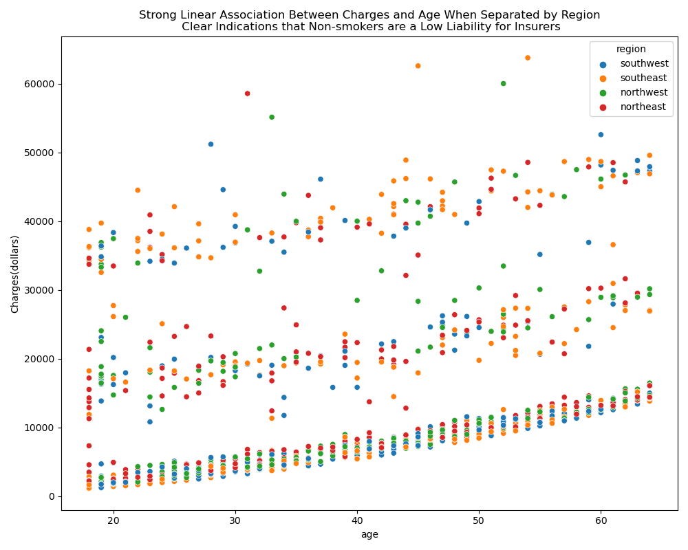

#  Insurance Cost Prediction & Risk Segmentation

This project explores how personal attributes such as **age**, **BMI**, **smoking habits**, and **geographic region** affect medical costs. 
It also segments individuals into cost groups to help insurers optimize premium pricing.

---

## Project Overview

**Dataset**: [Medical Cost Personal Dataset](https://raw.githubusercontent.com/stedy/Machine-Learning-with-R-datasets/master/insurance.csv)  
**Sample Size**: 1,338  
**Features**:  
- `age`: Age of primary beneficiary  
- `sex`: Gender of policyholder  
- `bmi`: Body Mass Index  
- `children`: Number of children covered by insurance  
- `smoker`: Smoking status  
- `region`: U.S. residential area  
- `charges`: Individual medical costs (target variable)

---

##  Techniques Used

- **Exploratory Data Analysis (EDA)**: Histograms, box plots, correlation heat maps, bivariate exploration via scatter plots and side-by-side box plots. 
- **Predictive Modeling**: Multiple Linear Regression
- Interpretation The multiple linear model explains 78% of the variability in health care costs based on the insured's demographic data. 
- **Clustering**: KMeans (planned)

---

## Data Visualizations & Exploration

##  Key Insights

- **Charges are heavily skewed to the right**, with a small group of individuals incurring very high costs.
- **Smoking status is a dominant factor** influencing medical expenses.
- **BMI and Age are also positively correlated with increased charges**.
- Most individuals fall into four cost brackets: **$0–15K**, **15K–30K**, **30K–50K**, and a few outliers over **$50K**.

### Model Coefficients Table

| Index | Feature              | Standard Deviation | Original Coefficients | Unstandardized Coefficients |
|-------|----------------------|---------------------|------------------------|-----------------------------|
| 4     | smoker_yes           | N/A                 | 11825.564428           | 11825.564428                |
| 3     | smoker_no            | N/A                 | -11825.564428          | -11825.564428               |
| 11    | y_intercpt           | N/A                 | 20311.928139           | -493.605637                 |
| 7     | region_northeast     | N/A                 | 459.585244             | 459.585244                  |
| 2     | children             | 1.205493            | 516.890247             | 428.779229                  |
| 10    | region_southwest     | N/A                 | -350.214110            | -350.214110                 |
| 1     | bmi                  | 6.098187            | 2036.228123            | 333.907135                  |
| 0     | age                  | 14.04996            | 3614.975415            | 257.294349                  |
| 9     | region_southeast     | N/A                 | -198.279052            | -198.279052                 |
| 8     | region_northwest     | N/A                 | 88.907918              | 88.907918                   |
| 6     | sex_male             | N/A                 | -9.295846              | -9.295846                   |
| 5     | sex_female           | N/A                 | 9.295846               | 9.295846                    |
 
### Interpretation of the fitted coefficients

- **y-intercept:**  The expected cost of health care is approximately 20K when all the input features are at their mean values in the dataset.

- **smoker_yes:** 	increases the cost by 11.5 thousand dollars compared to non-smokers.	

 - **BMI:** For each additional unit in BMI, the cost increases $316 if all other variables are held fixed.

- **Children:** For each additional child in the family, the cost increases by $528 if all other variables are fixed.

- **Sex_female:** For females, the cost increases by 51 dollars compared to males with the same age, BMI, etc.

-  The fitted coefficient shows the mean cost for the region variables if all other variables are at their mean value in the dataset.
-  This helps compare the group means. Southern regions have a lower average cost compared to northern ones.

---

### MLM Evaluation Metrics
- Interpretation The multiple linear model explains 78% of the variability in health care costs based on the insured's demographic data. 

##  File Structure
- EDA data visualizations and images. 
- Python Notebook: https://github.com/Nothgisrandom/Insurance_Cost_Estiamtion/blob/main/Insurance_EDA_with_Saved_Images.ipynb 
- `README.md`: Project summary and insights

---

##  Next Steps

- Add clustering for risk segmentation (low/medium/high)
- Build and evaluate machine learning models

---

